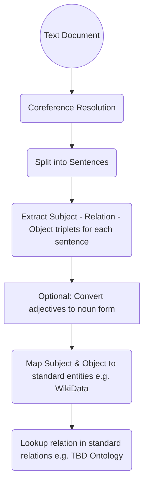

# Machine Reasoning
Efficient, Explainable Machine Reasoning

The goal is to use efficient methods (most often, far more efficient than LLM), wherever possible, to implement the desired functions

# Information Extraction

Map natural language information (from textbook chapters, technical papers or articles) to standard ontology and knowledge base such as [WikiData](https://www.wikidata.org/wiki/Wikidata:Main_Page)

Some interesting work related to information extraction
 
 * [Babelscape/rebel-large · Hugging Face](https://huggingface.co/Babelscape/rebel-large), referenced in [this article](https://towardsdatascience.com/extract-knowledge-from-text-end-to-end-information-extraction-pipeline-with-spacy-and-neo4j-502b2b1e0754)

 * Use of [SpaCy entity, dependency and noun chunk extraction]() to augment and improve quality of extraction

## Identify Relation Type

Once extracted triple is normalized, in order to integrate inference capabilities (with TypeDB), we need to identify the type of relation:

1. Subject is a type of Object: Defines a new type (subclass or instance of)
2. Object is an attribute of the Subject (define attribute for type of subject)
3. A proper relation between two entities

# Inferencing Knowledge

While WikiData is a powerful knowledge base, it does not support inference. There have been attempts in the past such as [SPIN](), but they didn't take off. One important goal of this project is to bring powerful inferencing capabilities to WikiData

# Chain of Thought Reasoning

Can we use rule based NLP to deduce chain of thoughts for reasoning about a certain question?

# Block Diagram

