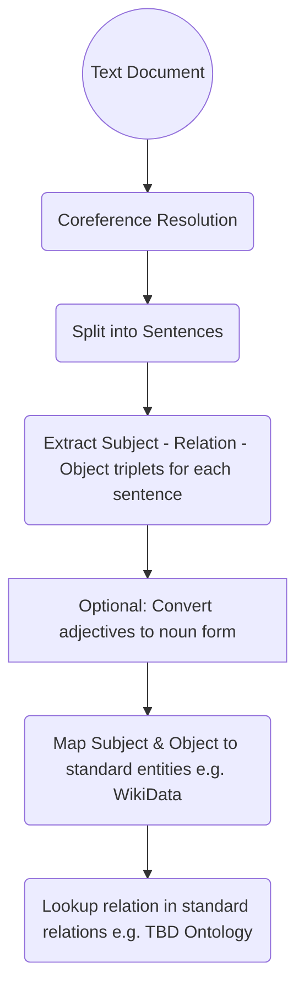

# Machine Reasoning
Efficient, Explainable Machine Reasoning

## Entity Relation Extraction
 
 * [Babelscape/rebel-large · Hugging Face](https://huggingface.co/Babelscape/rebel-large)

 * [Extract knowledge from text: End-to-end information extraction pipeline with spaCy and Neo4j](https://towardsdatascience.com/extract-knowledge-from-text-end-to-end-information-extraction-pipeline-with-spacy-and-neo4j-502b2b1e0754)

# Block Diagram

