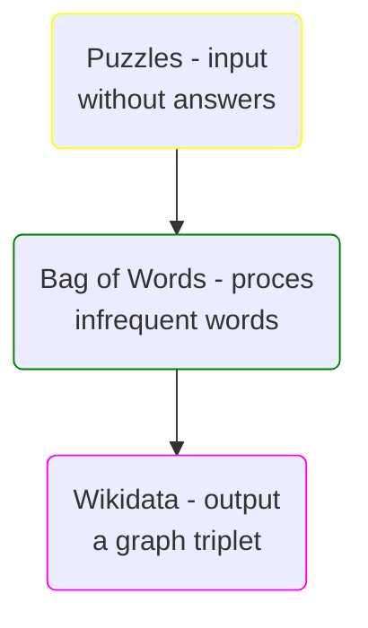

# Project description
## Objective 
I want to build a simple program that answers simple questions. Nowadays, LLM"s are used to help with different tasks like easy reasearch, homework, code writing etc. It consumes a lot of energy and outputs may vary.
## Main Goal 
My project is about a graph answering questions using some clues. Just give it some realy simple questions and it attempts to solve them using inference.

