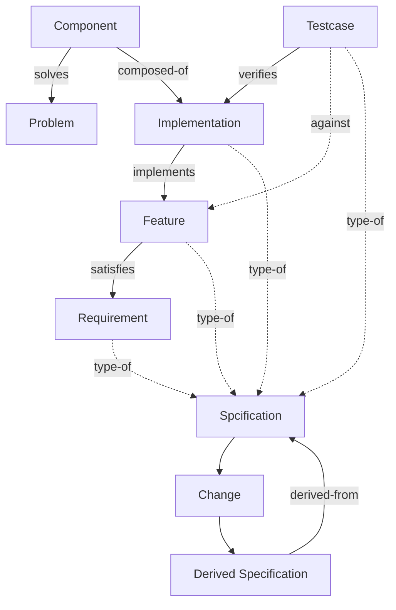

```mermaid
graph TD
    A[Component] --> |solves| C[Problem]
    D[Implementation] --> |implements| E[Feature]
    F[Testcase] --> |verifies| D
    F -.-> |against| E
    E --> |satisfies| G[Requirement]

    %% A --> |has| G

    A --> |composed-of| D
    %% A --> |part-of| A

	E -.-> |type-of| B[Spcification]
	D -.-> |type-of| B
	F -.-> |type-of| B
	G -.-> |type-of| B

	H[Derived Specification] --> |derived-from| B
	B --> J[Change] --> H
```